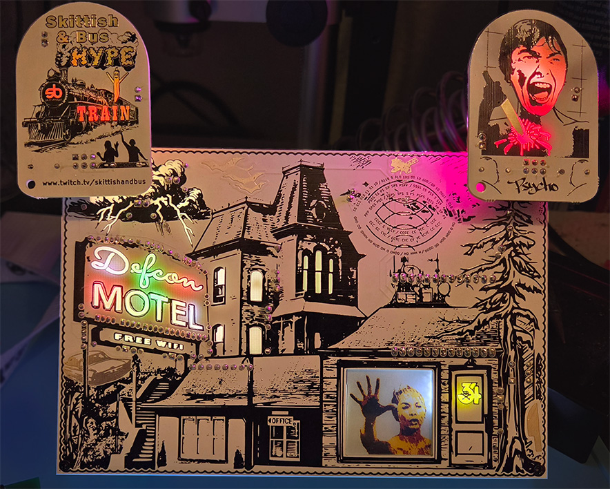

# Psycho Badge

Welcome to the Psycho Badge website.

This badge was designed for the DEFCON 34 security conference in August 2026.

On this page you will find all the details about this badge including an operations guide, some information about assembly, and a detailed review of the art and cicuit design and pcb design.

-- [@alt_bier](https://twitter.com/alt_bier)

---

# Overview

The badge theme was based on the 1960 movie Psycho by Alfred Hitchcock.

I wanted to make use of a multi-color eink display as a way to show scenes from the motel room and I think this worked out perfectly for that.

I also wanted to make use of electro-luminescent paint for the neon sign, but alas I couldn't work out the technical details in time to make that work on this badge.  But I think the back lit solder mask voids I ended up going with looks great.

[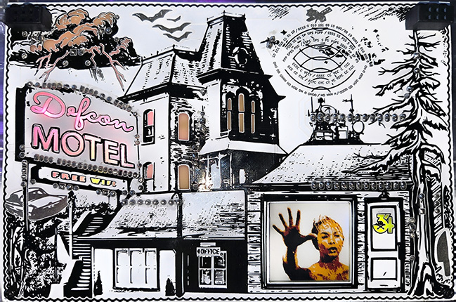](images/psycho_badge_pic_front.jpg)

[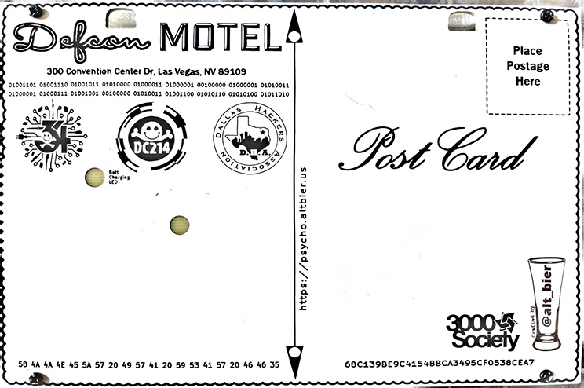](images/psycho_badge_pic_back.jpg)

The badge has two SAO connectors and I made a Psycho themed SAO that pairs well with the badge.

[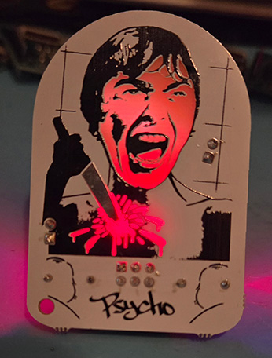](images/psycho_badge_pic_sao.jpg)

---

# Operations Guide

## Basic Operation

The on/off switch controls the battery power.  Due to a miscalculation on my part the switch is ON if it is in the down position relative to the top of the badge and OFF in the up position.

The badge can operate on USB C power with the battery switched off and it is recommended for the battery to be off when flashing code or using data to the ESP.

To charge the battery make sure the battery is turned on and plug it into USB power.  You will see an LED indicator on the back of the badge light up while the battery is charging and that light will go off when the battery is fully charged.

## Capacitive Touch Functions

### Short Press Of Touch Pads
To change the color of the LEDs in the neon sign press the BATS on the top left area of the badge.

To toggle the mode of the LEDs in the neon sign from static color to color wheel shifting colors or back again press the SATELLITE on the top right area of the badge.

To Turn the "Free Wifi" LEDs on or off press the CAR on the bottom left area of the badge.

To Turn the Defcon 34 Logo on the Door on or off press the KNIFE on the bottom right area of the badge. Note: This light also acts as a screen light since the EINK display is not backlit.

### Long Press Of Touch Pads

To change the display image to the next one in order press and hold the KNIFE for about 20 seconds.

To change the display image to the previous one in order press and hold the CAR for about 20 seconds.

To turn off all LEDs on the front of the badge while keeping the badge powered on (useful for battery charging unless you like a night lite) press and hold the BATS for about 40 seconds.

---

# Crypto Challenge

This is still a work in progress, but I will be adding more details soon.

---

# Details

Lets get into the details of this badge, like Art and Schematics and PCB design and Component choices.

## Pinout and Bill of Materials

Since there is a lot of information to cover, I have put the pinout and bill of materials on a separate page here:
[Psycho Badge Pinout and Bill of Materials](psycho_badge_pinout_and_BOM.md)

## Schematics 

Since the ESP Dev board has an embedded battery charge circuit and the fact that I moved all the eink display circuitry to a seperate dev board, the schematic for the main badge was fairly simple.

[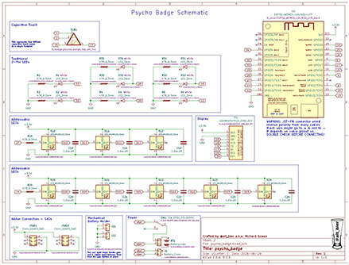](images/psycho_badge_schematic.jpg)

The schematic for the eink display dev board was a bit more complex but I basically just stole its design from the dev board that the nice people at Good Display sell since they put thier schematic online.

[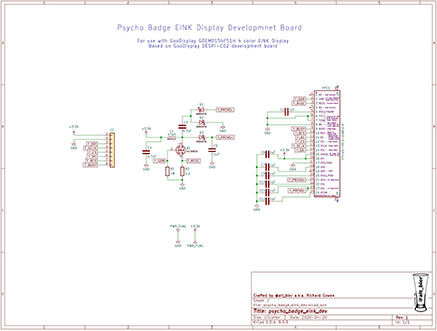](images/psycho_badge_eink_dev_schematic.jpg)

The SAO schematic is basically a cut and paste from what I did for the G0dzilla badge minus the extra resistors at different values, making it a much simpler template I can reuse in the future as well.

[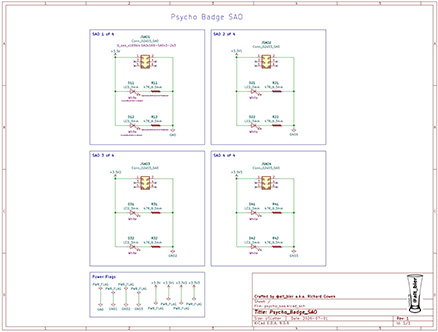](images/psycho_badge_sao_schematic.jpg)

## PCB Design

The PCB layout and tracing of the badge PCBs was a challenge due to all the solder mask voids and capacitive touch areas and cutouts and other areas to avoid.

[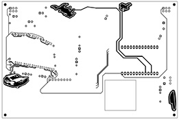](images/psycho_badge_pcb_front_cu_crop.jpg)

[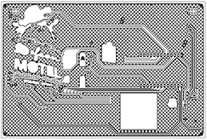](images/psycho_badge_pcb_back_cu_crop.jpg)

The PCB layout and tracing of the eink dev board was fairly easy, with the hardest part being squishing everything together to keep the PCB size as small as possible.

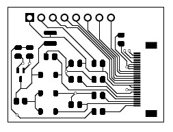

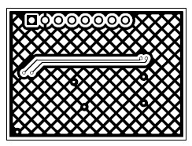

The PCB layout and tracing of the SAO was simple given how few components there are.

[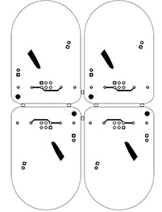](images/psycho_badge_sao_pcb_front_cu_crop.jpg)

[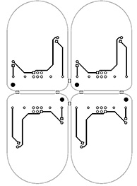](images/psycho_badge_sao_pcb_back_cu_crop.jpg)

