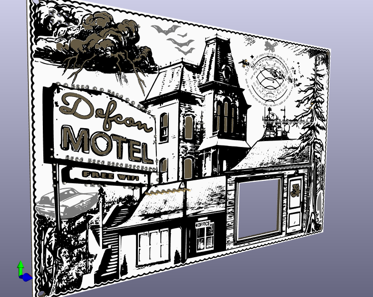

# Psycho Badge

Welcome to the Psycho Badge website.

This badge was designed for the DEFCON 34 security conference in August 2026.

On this page you will find all the details about this badge including an operations guide, some information about assembly, and a detailed review of the art and cicuit design and pcb design.

-- [@alt_bier](https://twitter.com/alt_bier)

---

*** Insert Image Here ***

# Overview

The badge theme was based on the 1960 movie Psycho by Alfred Hitchcock.

I wanted to make use of a multi-color eink display as a way to show scenes from the motel room and I think this worked out perfectly for that.

I also wanted to make use of electro-luminescent paint for the neon sign, but alas I couldn't work out the technical details in time to make that work on this badge.  But I think the back lit solder mask voids I ended up going with looks great.

*** Insert Image Here ***

*** Insert Image Here ***

The badge has two SAO connectors and I made a Psycho themed SAO that pairs well with the badge.

*** Insert Image Here ***

---

*** Insert Image Here ***

# Operations Guide

---

*** Insert Image Here ***

# Crypto Challenge

---

*** Insert Image Here ***

# Details

Lets get into the details of this badge, like Art and Schematics and PCB design and Component choices.

## Schematics 

Since the ESP Dev board has an embedded battery charge circuit and the fact that I moved all the eink display circuitry to a seperate dev board, the schematic for the main badge was fairly simple.

*** Insert Image Here ***

The schematic for the eink display dev board was a bit more complex but I basically just stole its design from the dev board that the nice people at Good Display sell since they put thier schematic online.

*** Insert Image Here ***

The SAO schematic is basically a cut and paste from what I did for the G0dzilla badge minus the extra resistors at different values, making it a much simpler template I can reuse in the future as well.

*** Insert Image Here ***

## PCB Design

The PCB layout and tracing of the badge PCBs was a challenge due to all the solder mask voids and capacitive touch areas and cutouts and other areas to avoid.

*** Insert Image Here ***

The PCB layout and tracing of the eink dev board was fairly easy, with the hardest part being squishing everything together to keep the PCB size as small as possible.

*** Insert Image Here ***

The PCB layout and tracing of the SAO was simple given how few components there are.

*** Insert Image Here ***

